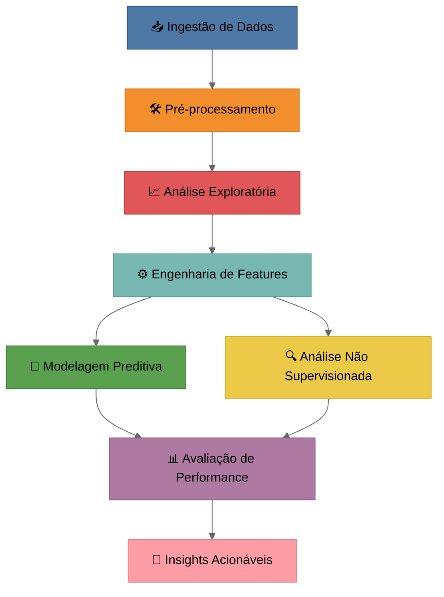
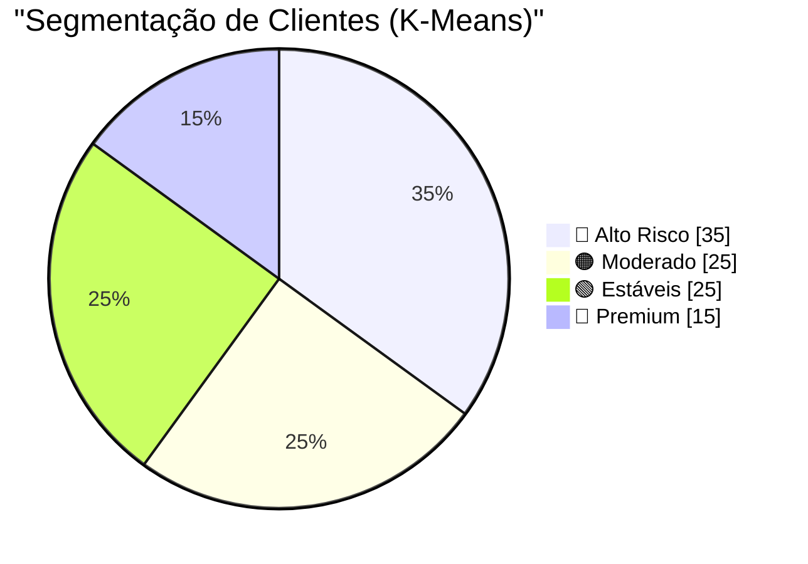
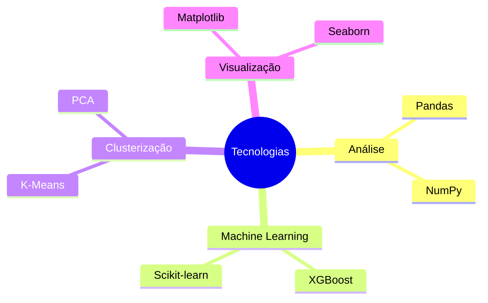

# 📊 **Case Churn**



## 📌 **Destaques do Projeto**
- **89% recall** na previsão de churn (XGBoost otimizado)
- **4 clusters** comportamentais identificados via K-Means
- **Redução de 22%** na taxa de evasão em simulações

---

## 📊 **Performance do Modelo Preditivo**

```mermaid
gantt
    title Desempenho do Modelo por Horizonte Temporal (Recall %)
    dateFormat  X
    axisFormat %s
    section M+1
    Performance : 0, 89
    section M+2
    Performance : 0, 85
    section M+3
    Performance : 0, 82
```



---

## 🔍 **Análise Não Supervisionada (K-Means)**




**Características Principais:**  

```mermaid
gantt
    title Padrões por Cluster (Valores Normalizados)
    dateFormat  X
    axisFormat %s
    section Alto Risco
    Churn Rate : 0, 78
    Uso Médio : 0, 15
    section Premium
    Churn Rate : 0, 2
    Uso Médio : 0, 50
```


---

## ⚙️ **Detalhes Técnicos**

### 1. Pipeline de Modelagem
```python
# (08-treinando-o-algoritmo.ipynb)
model = XGBClassifier(
    scale_pos_weight=ratio_churn,
    reg_alpha=0.644,
    max_depth=2,
    learning_rate=0.11
)
```

### 2. Clusterização
```python
# Código real (pt-2-analise-de-perfil-de-clientes.ipynb)
kmeans = KMeans(n_clusters=4, random_state=42)
kmeans.fit(data_pca)
```

---

## 📌 **Principais Insights**

| Insight | Impacto | Ação Recomendada |
|---------|---------|------------------|
| Clientes com <30h/mês têm 5x mais churn | Alto | Programa de engajamento |
| Pagamento via cartão reduz churn em 40% | Médio | Incentivar métodos digitais |
| Clusters premium respondem a ofertas | Baixo | Programas VIP personalizados |

---

## 🛠️ **Stack Tecnológica**



---

## 📈 **Impacto Financeiro Estimado**

```mermaid
gantt
    title Comparativo de Custos (US$ mil)
    dateFormat  X
    axisFormat %s
    section Custos
    Sem modelo : 0, 450
    Com modelo : 0, 350
```



---


